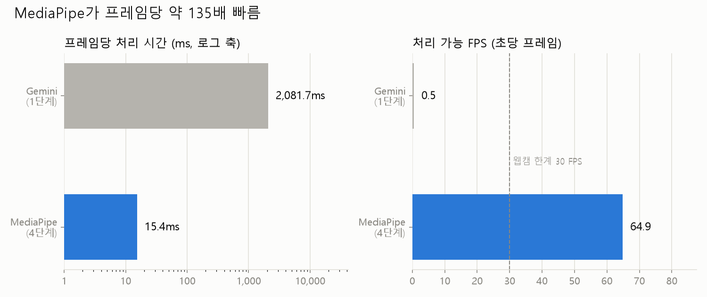
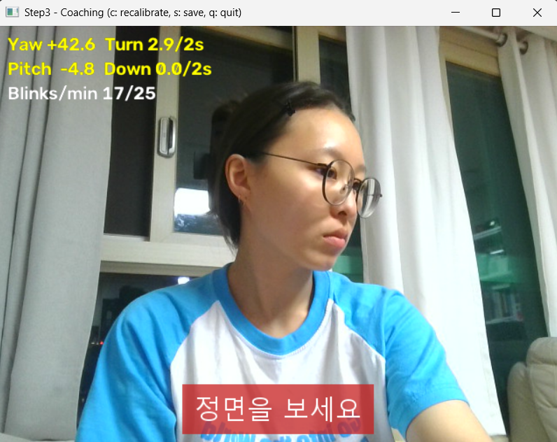
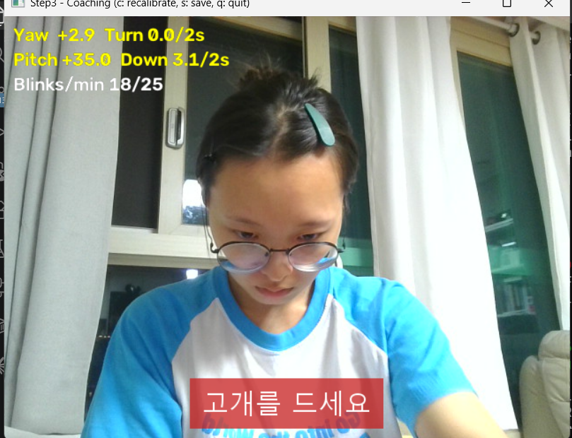
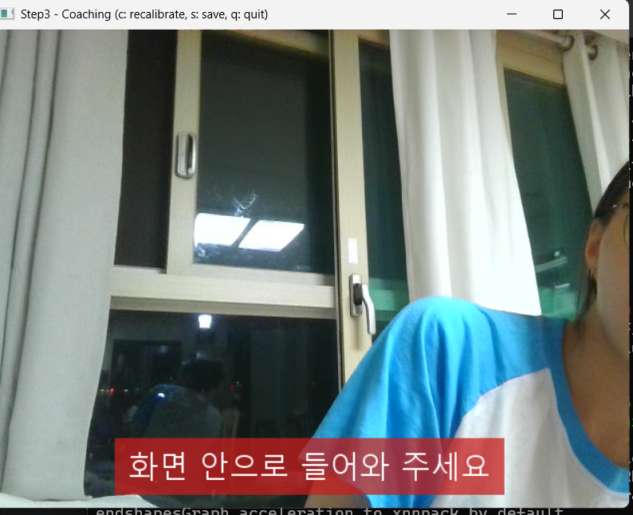
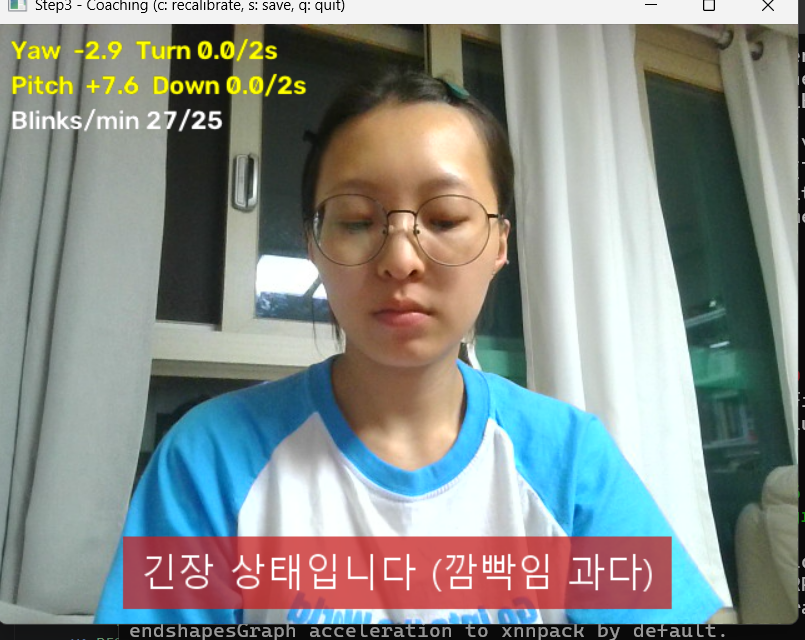

# 얼굴 움직임 실시간 탐지 PoC 요약

작성일: 2026-10-03

AI 면접·발표 실시간 코칭 서비스에서 **웹캠으로 고개 방향·표정을 실시간으로 잡아 바로 피드백할 수 있는지** 확인한 PoC입니다. 5단계로 나눠 진행했고, 이 문서는 그 결과를 한 곳에 모은 요약입니다. 측정값과 근거를 자세히 보려면 [RESULTS.md](RESULTS.md)를, 직접 실행하려면 [README.md](README.md)를 보세요.

## 결론

**실시간 코칭은 로컬에서 도는 MediaPipe와 규칙만으로 충분합니다. 비전 AI(Gemini)는 실시간 경로에 쓰기에 너무 느립니다.**

| | Gemini (비전 AI) | MediaPipe + 규칙 |
|---|---|---|
| 프레임 1장 처리 시간 (평균) | 2,082ms | **15.4ms** (약 135배 빠름) |
| 1초에 판정하는 횟수 | 0.5번 | **30번** (웹캠 최대 속도) |
| 안정성 | 응답이 1.5~4초로 들쭉날쭉하고, 서버 혼잡(503)으로 실패하기도 함 | 902프레임 중 30 FPS에 주어진 시간(33ms)을 넘긴 프레임 0개 |
| 영상이 나가는 곳 | Google 서버 | 내 PC 밖으로 안 나감 |
| 비용 | 요청마다 API 비용 | 없음 |

- 고개 돌림·숙임, 깜빡임 과다, 얼굴 이탈 경고 4종이 실제 웹캠에서 모두 제때 떴습니다.
- Gemini는 "골똘히 생각하는 표정"처럼 사람이 읽기 좋은 해석을 해 줍니다. 그래서 면접이 끝난 뒤 리포트를 만들 때 보조로 쓰는 쪽이 맞아 보입니다.



## 단계별로 한 일

| 단계 | 한 일 | 결과 | 바로가기 |
|---|---|---|---|
| 1 | 웹캠 사진 1장을 Gemini에 보내 고개 방향·시선·표정을 JSON으로 받기. 10회 반복해 시간 측정 | 평균 **2.08초**. 지연의 99% 이상이 API 응답 대기 | [사용법](README.md#1단계-ai-분석-지연-측정) · [결과](RESULTS.md#1단계-ai-분석-지연) |
| 2 | MediaPipe Face Landmarker로 얼굴 점 478개를 찾고 고개 각도(좌우·위아래·기울기)와 표정 점수(깜빡임·미소) 계산 | 왼쪽 −41°, 오른쪽 +31°, 숙임 +18°. 깜빡임·미소 점수도 뚜렷하게 구분됨 | [사용법](README.md#2단계-얼굴-랜드마크고개-각도) · [결과](RESULTS.md#2단계-mediapipe-face-landmarker) |
| 3 | 2단계에서 계산한 고개 각도와 깜빡임 점수로 "고개를 20° 넘게 2초 돌리면 경고" 같은 규칙을 판정해 화면에 한글 경고 표시. 시작할 때 사용자의 정면 자세를 0°로 자동 보정 | 경고 4종 모두 정상 동작. 테스트 20개 통과 | [사용법](README.md#3단계-규칙-기반-실시간-코칭) · [결과](RESULTS.md#3단계-규칙-기반-탐지) |
| 4 | 3단계 코칭 화면을 그대로 띄운 채 FPS와 프레임당 처리 시간을 30초 동안 측정 → 1단계 Gemini 결과와 비교 | 처리 **15.4ms**, 화면 **30 FPS**, Gemini 대비 **약 135배** 빠름 | [사용법](README.md#4단계-실시간-처리-속도-측정과-1단계-비교) · [결과](RESULTS.md#4단계-처리-속도-비교) |
| 5 | 결과 캡처와 사용 기술 정리 | 해당 문서 | — |

### 3단계 규칙

| 경고 | 조건 |
|---|---|
| 정면을 보세요 | 좌우로 20° 이상 돌린 상태가 2초 이어짐 |
| 고개를 드세요 | 15° 이상 숙인 상태가 2초 이어짐 |
| 긴장 상태입니다 (깜빡임 과다) | 최근 1분 동안 깜빡임 25회 초과 (평소 측정값 17~18회) |
| 화면 안으로 들어와 주세요 | 얼굴이 2초 이상 안 보임 |

기준값은 모두 2단계 실측 데이터를 보고 정했습니다. 근거는 [RESULTS.md 3단계](RESULTS.md#3단계-규칙-기반-탐지)에 있습니다.

| 정면을 보세요 | 고개를 드세요 | 화면 안으로 들어와 주세요 | 긴장 상태입니다 |
|---|---|---|---|
|  |  |  |  |

## 동작 방식

```
웹캠 프레임 (30 FPS)
  → 좌우 반전 (거울 화면)
  → MediaPipe Face Landmarker: 얼굴 점 478개, 회전 행렬, 표정 점수      ← 약 15ms (처리 시간의 98%)
  → 고개 각도 계산 (Yaw 좌우 / Pitch 위아래 / Roll 기울기) − 보정 기준값
  → 규칙 판정 (지속 시간, 1분 깜빡임 수)                                  ← 약 0.3ms
  → 한글 경고 표시 (문구 이미지를 시작할 때 미리 만들어 두고 붙이기만 함)
```

모든 처리가 내 PC 안에서 돌아갑니다. API 키가 필요한 건 1단계(Gemini 측정)뿐입니다.

## 사용 기술

측정은 Windows에서 했고, 아래는 그때 쓴 버전입니다.

| 기술 | 버전 | 용도 |
|---|---|---|
| Python | 3.14.5 (Windows) | 실행 환경. WSL에서는 웹캠이 보이지 않아 Windows에서 실행 |
| MediaPipe (Tasks API) | 1.0.1 | Face Landmarker: 얼굴 점, 회전 행렬, 표정 점수(blendshapes) |
| Face Landmarker 모델 | `face_landmarker.task` (float16, 약 4MB) | 처음 실행할 때 Google 공식 저장소에서 자동 다운로드 |
| OpenCV (contrib) | 5.0.0.93 | 웹캠 캡처, 화면 표시. MediaPipe가 contrib 버전을 요구 |
| Pillow | 12.3.0 | 한글 문구 그리기 (OpenCV는 한글을 못 그림) |
| NumPy | 2.5.3 | 각도·통계 계산 |
| matplotlib | 3.11.2 | 4단계 비교 그래프 |
| google-genai | 2.27.0 | 1단계 Gemini API 호출 |
| Gemini 모델 | `gemini-3.5-flash-lite` | 1단계 비교 대상. `gemini-2.5-flash`는 신규 사용자에게 막혀 있고(404), `gemini-3.8-flash`는 서버 혼잡(503)이 잦고 20~40초 걸려서 바꿈 |
| python-dotenv | 1.2.4 | `.env`에서 API 키 읽기 |
| pytest | 9.1.1 | 3단계 규칙 테스트 (2단계 실측 기록 재생 포함) |

## 한계

- **기준값이 한 사람의 데이터로만 정해졌습니다.** 측정자 1명, 웹캠 1대, 실내 두 곳에서 잰 값입니다. 다른 사람이나 다른 환경(조명, 안경, 카메라 높이)에서는 값이 달라질 수 있습니다.
- **시선(눈동자 방향)은 다루지 않았습니다.** 원래 목표에 있었지만 고개 방향으로만 대신했습니다. 고개는 정면인데 눈만 딴 데를 보는 경우는 잡지 못합니다.
- **"깜빡임이 많으면 긴장"은 단순화한 가정입니다.** 1분 25회라는 기준도 검증된 값이 아니라, 측정자의 평소 값(17~18회)을 보고 정한 값입니다.
- **고개를 크게 돌리면 다른 값도 같이 움직입니다.** 30~40° 돌리면 위아래·기울기 각도가 ±13~18° 함께 변하고, 눈을 뜨고 있어도 깜빡임 점수가 0.2~0.36까지 올라갑니다. 규칙에서 피해 가도록 설계했지만, 더 큰 각도에서는 확인하지 않았습니다.
- **처리 속도는 노트북 한 대에서 잰 값입니다.** CPU 사양에 따라 달라집니다. 웹 브라우저에서 돌렸을 때의 속도는 재지 않았습니다.
- **Gemini 비교는 한 모델, 10회 측정입니다.** 모델과 시간대(서버 혼잡)에 따라 결과가 크게 달라질 수 있습니다.
- **얼굴 한 명만 처리합니다.**

## 다음 할 일

1. **다른 사람, 다른 환경으로 기준값 검증**: 2~3명 이상이 3단계를 써 보고, 경고가 너무 자주 또는 너무 늦게 뜨는지 확인합니다. 깜빡임 기준은 애매하면 25회에서 30회로 올리는 것을 검토합니다.
2. **시선 탐지 추가**: Face Landmarker가 이미 주는 눈동자 점(468~477번)으로 "카메라를 보고 있는지"를 판정합니다.
3. **실제 서비스 형태 결정**: 서비스가 웹이라면 MediaPipe 웹(JavaScript) 버전으로 브라우저에서 같은 속도가 나오는지 측정합니다.
4. **면접 후 리포트**: 3단계의 경고 기록(`step3_events.csv`)을 바탕으로 요약을 만들고, 필요하면 Gemini로 정성적인 코멘트를 더합니다.
5. **표정 활용**: 지금은 미소 점수를 화면에 표시만 합니다. "계속 무표정"처럼 규칙으로 쓸 수 있는지 검토합니다.

## 직접 실행해 보려면

[README.md](README.md)의 순서를 따라 하면 됩니다. 요약하면 이렇습니다.
- **Windows에서 실행해야 합니다.** WSL에서는 웹캠이 보이지 않습니다.
- `pip install -r requirements.txt` 후 `python step3_coaching.py`를 실행하면 코칭 화면이 뜹니다.
- 1단계만 Gemini API 키(`.env`)가 필요합니다.
